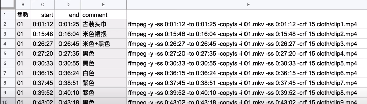

# 命令行剪视频
From [用命令行剪视频？玩转Linux命令行 - SP1](https://www.youtube.com/watch?v=kmGn356LaZ8)

## Tools
- ffmpeg: 视频转码合成
- grep  : 文本查找
- awk   : 文本处理
- sed   : 文本处理
- xargs : 并行命令执行
- google sheet : 记录时间轴，生成命令
- arctime pro : 时间轴
- final cut pro X : 精剪

## ffmpeg commands
- Generate a clip
```
  ffmpeg -ss start_time -to end_time -i input_file output_file

  -ss position
```

- Merge clips
```
  ffmpeg -f concat -safe 0 -i files.text -c copy output_file
```

##  create clip Method 1 [Step 1]
利用google sheet 生成 create clip的命令
input start time, end time in google sheet. Use google sheet formula to create command


copy-paste the command generated by google sheet to command line, run them.

## create clip Method 2 [Step 1]
arctime pro  -> Export -> Subitle File

利用 arctime pro 生成 字幕文件(.srt)，利用其中的时间轴信息 create clip

.srt 文件的内容为
```
  00:01:17,800 ---> 00:11:24,345
  ...
```
使用Pipe Line 处理.srt 文件 来生成 clip
```
  cat 1.src \
  | grep -e "--->" \
  | dos2unix \
  | sed  \'s/,/./g'  \
  | awk '{print "-y -ss", $1, "-to", $3, "-i 1.mkv clip"NR".mp4"}' \
  | xargs -L 1 ffmpeg
```
grep 找出所有包含"--->"的行

dos2unix: arctime pro使用windows换行符, 因此把windows换行符换成nuix换行符

sed 把 时间轴中的, 换成.

awk 为ffmpeg生成命令行参数
```
-y -ss <start time> -to <end_time> -i 1.mkv clip<number of record>.mp4
```
xargs 每次读取一行awk生成的命令，传递给ffmpeg

## create clip file list [Step 2]
Put all *.mp4 files in files.txt
```
  find . -name '*.mp4' | awk '{print "file", $1} > files.txt
```
like
```
  file ./clip1.mp4
  ...
```

## Merge clip files [Step 3]
```
  ffmpeg -y -f concat -safe 0 -i files.txt -c copy output.mov
```

Step 2 and Step 3 can be put into a concat.sh file
```
  find . -name '*.mp4' | awk '{print "file", $1} > files.txt

  ffmpeg -y -f concat -safe 0 -i files.txt -c copy output.mov
```